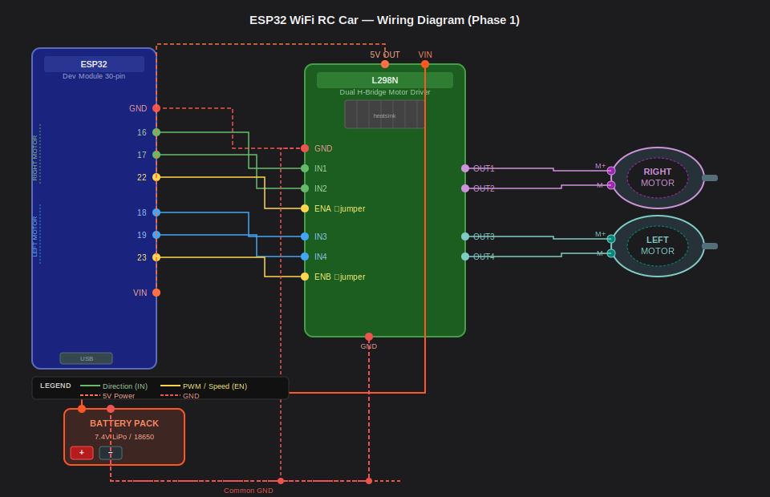

<div align="center">

# 🚗 ESP32 SmartCar — Intelligent Multi-Mode Robot Vehicle

**A progressive, firmware-driven RC car project built on the ESP32 platform**  
*WiFi Control → Obstacle Avoidance → Gesture Control*

[](https://www.espressif.com/)
[](https://www.arduino.cc/)
[]()
[]()
[]()
[](LICENSE)

</div>

---

## 🧠 Project Vision

ESP32 SmartCar is not just another RC car — it's a **multi-phase embedded systems project** that grows from a simple WiFi-controlled vehicle into an intelligent, sensor-aware robot capable of responding to hand gestures. Each phase introduces new hardware, firmware architecture decisions, and real-world engineering challenges.

> Built as a personal learning and portfolio project by **Farhan**, 2nd-year CSE student at KUET.

---

## 🗺️ Project Roadmap

| Phase | Title | Status | Key Tech |
|-------|-------|--------|----------|
| **1** | [WiFi Browser Control](#-phase-1--wifi-browser-control) | ✅ Complete | ESP32 SoftAP, WebServer, L298N PWM |
| **2** | Obstacle Avoidance | 🔄 In Progress | HC-SR04, millis() FSM, Auto/Manual toggle |
| **3** | Hand Gesture Control | 📅 Planned | MPU-6050, second ESP32, HTTP gesture TX |

---

## ✅ Phase 1 — WiFi Browser Control

> **Project Name: `esp32-wifi-rc-car`**

The ESP32 hosts its own WiFi access point and serves a mobile-responsive web interface. Any device can connect and control the car — no internet, no app, no cloud.

### 📸 Demo & Media

> See [`media/photos/`](media/photos/) and [`media/videos/`](media/videos/) for real build photos and demo videos.

### ⚙️ How It Works

```
Phone/PC  ──WiFi──▶  ESP32 SoftAP  ──HTTP GET──▶  WebServer  ──▶  rotateMotor()  ──▶  L298N  ──▶  DC Motors
                         192.168.4.1
```

1. ESP32 boots and creates a WiFi hotspot (`ESP32_CAR`)
2. User connects their phone/laptop to that network
3. Browser opens `192.168.4.1` — the ESP32 serves the control page
4. Touch buttons send HTTP GET requests (`/forward`, `/left`, etc.)
5. ESP32 handles the route and drives the motors via L298N using PWM

### 🔌 Pin Assignment

| Signal | ESP32 GPIO |
|--------|-----------|
| Right Motor IN1 | 16 |
| Right Motor IN2 | 17 |
| Right Motor EN (PWM) | 22 |
| Left Motor IN1 | 18 |
| Left Motor IN2 | 19 |
| Left Motor EN (PWM) | 23 |

> PWM: 1000 Hz, 8-bit resolution, `MAX_MOTOR_SPEED = 200`  
> ESP32 Core: **v2.x** (`ledcSetup` / `ledcAttachPin` API)

### 📐 Circuit Diagram



> Full wiring details: [`docs/wiring_phase1.md`](docs/wiring_phase1.md)

### 📁 Source Code

[`phase1_manual_wifi/phase1_manual_wifi.ino`](phase1_manual_wifi/phase1_manual_wifi.ino)

### 🚀 Flash & Run

1. Install [Arduino IDE](https://www.arduino.cc/en/software) (2.x recommended)
2. Add ESP32 board support: `https://raw.githubusercontent.com/espressif/arduino-esp32/gh-pages/package_esp32_index.json`
3. Select board: **ESP32 Dev Module**
4. Open `phase1_manual_wifi/phase1_manual_wifi.ino`
5. Upload → Open Serial Monitor at 115200 baud
6. Connect to WiFi `ESP32_CAR` (password: `12345678`)
7. Open browser → `192.168.4.1`

---

## 🔄 Phase 2 — Obstacle Avoidance *(Coming Soon)*

Adds an HC-SR04 ultrasonic sensor and a **Manual / Auto** mode toggle to the web UI.  
In Auto mode the car drives itself — detecting and avoiding obstacles using a non-blocking `millis()`-based state machine.

See [`docs/wiring_phase2.md`](docs/wiring_phase2.md) for planned pin assignments.

---

## 🤚 Phase 3 — Hand Gesture Control *(Planned)*

A second ESP32 worn on the wrist reads pitch/roll from an MPU-6050 IMU and sends HTTP commands to the car over WiFi. A third **Gesture** mode in the web UI activates this.

See [`docs/wiring_phase3.md`](docs/wiring_phase3.md) for planned architecture.

---

## 📦 Repository Structure

```
esp32-smartcar/
├── phase1_manual_wifi/
│   └── phase1_manual_wifi.ino       # Phase 1 firmware (complete)
├── phase2_obstacle_avoidance/
│   └── phase2_obstacle_avoidance.ino  # Phase 2 firmware (WIP)
├── phase3_gesture_control/
│   ├── car_receiver/
│   │   └── car_receiver.ino         # Car-side receiver firmware
│   └── gesture_transmitter/
│       └── gesture_transmitter.ino  # Wrist ESP32 firmware
├── docs/
│   ├── circuit_phase1.svg           # Phase 1 circuit diagram
│   ├── wiring_phase1.md             # Phase 1 wiring guide
│   ├── wiring_phase2.md             # Phase 2 wiring guide
│   └── wiring_phase3.md             # Phase 3 wiring guide
├── media/
│   ├── photos/                      # Build & demo photos (add yours here)
│   └── videos/                      # Demo video clips (add yours here)
├── README.md
└── LICENSE
```

---

## 🛠️ Hardware Bill of Materials

| Component | Qty | Notes |
|-----------|-----|-------|
| ESP32 Dev Board (30-pin) | 1 | Main MCU |
| L298N Dual H-Bridge | 1 | Motor driver |
| DC Gear Motor | 2 | ~200 RPM, differential drive |
| HC-SR04 Ultrasonic Sensor | 1 | Phase 2 |
| MPU-6050 IMU | 1 | Phase 3 |
| ESP32 Dev Board (30-pin) | 1 | Phase 3 gesture transmitter |
| 7.4V LiPo / 18650 pack | 1 | Power supply |
| Jumper wires, chassis | — | Standard RC chassis |

---

## 🧩 Technical Highlights

- **No external dependencies** — only built-in ESP32 Arduino core headers (`WiFi.h`, `WebServer.h`)
- **Embedded web server** — full HTML/CSS/JS UI served from microcontroller flash memory
- **Hardware PWM** via LEDC peripheral for smooth motor speed control
- **Touch-event driven UI** — `ontouchstart`/`ontouchend` for instant mobile response with auto-stop
- **Differential drive turning** — full-speed counter-rotation for zero-radius turns
- **SoftAP mode** — completely offline, no router needed

---

## 📄 License

MIT License — see [LICENSE](LICENSE)

---

<div align="center">
Made with ☕ and solder by <strong>Farhan</strong> · KUET CSE · 2024–2025
</div>
